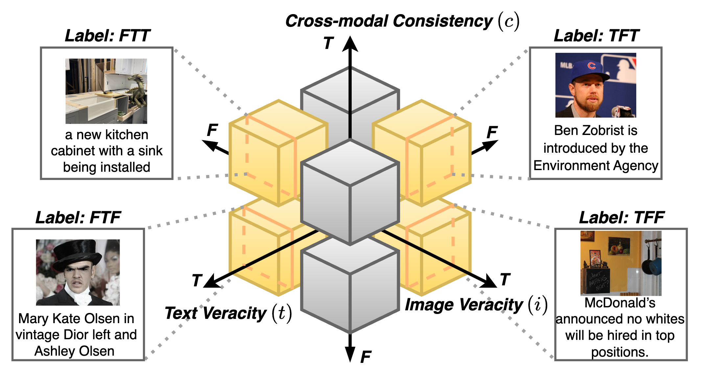

<div align="center">
  
  <h1>OctantFake & OctantAgent</h1>
  <p><strong>An 8-Way Taxonomy for Multimodal Disinformation and Detection Benchmark</strong></p>
  <p>
    <a href="https://doi.org/10.1145/3774904.3792906"></a>
    <a href="https://huggingface.co/datasets/Syokan/OctantFake"></a>
    <a href="LICENSE"></a>
    
  </p>
  <p>
    <a href="#installation">Installation</a> ·
    <a href="#octantfake-dataset">Dataset</a> ·
    <a href="#octantagent">Method</a> ·
    <a href="#reproduction">Reproduction</a> ·
    <a href="#citation">Citation</a>
  </p>
</div>

Official implementation and dataset release for the WWW '26 short paper by Shuhan Cui, Ruimin Chu,
Hanrui Wang, Patrick H. Chen, Ching-Chun Chang, and Isao Echizen.

OctantFake formulates multimodal disinformation along three ordered binary axes—**image veracity,
text veracity, and image-text consistency**—to produce eight mutually exclusive labels. OctantAgent
checks these axes independently with external evidence and fuses the decisions into one label.

<p align="center">
  
</p>

## News

- **July 2026:** Code, prompts, construction tools, exact experiment metadata, and the OctantFake
  v1.0.0 release package are available.
- An extended version of this work will be released with subsequent journal work.

## Highlights

- **Exhaustive taxonomy:** all combinations of image truthfulness, text truthfulness, and cross-modal
  agreement are represented.
- **Balanced benchmark:** 8,800 English image-text pairs, with 1,100 samples in each of eight classes.
- **Zero-shot protocol:** an 800-sample calibration split and an 8,000-sample test split; no training
  split is provided.
- **Auditable method:** prompt templates, evidence formats, parsing rules, run metadata, and the common
  8-way evaluator are included.
- **Reproducible construction:** source adapters, CLIP thresholds, deterministic selection, portable
  manifests, and release manifests and checksums are versioned

## Installation

### Core tools

Python 3.10 or later is required. The core install supports manifests, evaluation, and tests without
downloading any model.

```bash
git clone https://github.com/SaiSyokan/8way-multimodal-disinformation.git
cd 8way-multimodal-disinformation
python -m venv .venv
source .venv/bin/activate
python -m pip install --upgrade pip
python -m pip install -e .
```

Optional dependency groups can be installed separately or together:

```bash
python -m pip install -e '.[builder,evidence,inference]'
```

For a Conda-based setup, use `conda env create -f environment.yml`. LLaVA is intentionally not
vendored; install the upstream implementation compatible with your chosen checkpoint before using
the LLaVA backend. Platform, CUDA, and credential notes are in
[`docs/INSTALLATION.md`](docs/INSTALLATION.md).

Verify the installation:

```bash
octantfake validate examples/manifest.example.jsonl
octantfake evaluate examples/predictions.example.jsonl
python -m unittest discover -s tests -v
```

The committed examples are synthetic and contain no benchmark media.

## OctantFake dataset

The media is hosted in a separate [Hugging Face dataset repository](https://huggingface.co/datasets/Syokan/OctantFake),
while exact experiment manifests and checksums are versioned under [`data/`](data/).

| Property | Value |
|---|---:|
| Samples | 8,800 |
| Labels | `TTT`, `TTF`, `TFT`, `TFF`, `FTT`, `FTF`, `FFT`, `FFF` |
| Per label | 1,100 |
| Calibration / test | 800 / 8,000 |
| Training split | None |
| Core media size | Approximately 1.3 GB |

Download and validate the release:

```bash
python -m pip install --upgrade huggingface_hub
hf download Syokan/OctantFake --repo-type dataset --local-dir data/OctantFake
octantfake validate data/OctantFake/metadata/octantfake.jsonl \
  --check-files --media-root data/OctantFake
```

Or load the ImageFolder view directly:

```python
from datasets import load_dataset

dataset = load_dataset("Syokan/OctantFake")
calibration = dataset["validation"]  # the paper calls this split "calibration"
test = dataset["test"]
```

This composite dataset retains the terms and rights of its 16 upstream sources; the code's MIT
license does not apply to the media. Review the [dataset card](data/DATASET_CARD.md),
[source notice](THIRD_PARTY_DATA.md), and [data terms](data/TERMS_OF_USE.md) before use.

## Eight-way label space

Labels always follow **image / text / consistency** order. For image and text, `F` indicates a
verifiable factual violation, while `T` means that no violation was detected under the fixed
verification budget. For consistency, `T` is a match and `F` is a mismatch.

| Label | Image | Text | Image-text relationship |
|---|---|---|---|
| `TTT` | T | T | match |
| `TTF` | T | T | mismatch |
| `TFT` | T | F | match |
| `TFF` | T | F | mismatch |
| `FTT` | F | T | match |
| `FTF` | F | T | mismatch |
| `FFT` | F | F | match |
| `FFF` | F | F | mismatch |

See [`docs/TAXONOMY.md`](docs/TAXONOMY.md) for the operational definitions.

## OctantAgent

OctantAgent uses four auditable stages:

1. create image descriptions for factual and consistency checks;
2. assess image veracity from the image, its description, and reverse-image evidence;
3. assess text veracity from the claim and the top three text-search results, and assess consistency
   independently from the image description and text;
4. aggregate the three ordered decisions into the final eight-way label.

All paper-aligned templates are in
[`src/octantfake_www/method/prompts.py`](src/octantfake_www/method/prompts.py) and documented in
[`docs/PROMPTS.md`](docs/PROMPTS.md). Evidence is stored separately from the dataset so every run can
record the provider, collection date, and snapshot checksum.

Collect a new evidence snapshot:

```bash
export GOOGLE_CUSTOM_SEARCH_API_KEY='...'
export GOOGLE_CUSTOM_SEARCH_ENGINE_ID='...'
gcloud auth application-default login

octantfake collect-text-evidence \
  --manifest data/OctantFake/metadata/test.jsonl --output evidence/
octantfake collect-image-evidence \
  --manifest data/OctantFake/metadata/test.jsonl \
  --media-root data/OctantFake --output evidence/
```

Run the open LLaVA backend after installing a compatible upstream LLaVA environment:

```bash
octantfake run \
  --manifest data/OctantFake/metadata/test.jsonl \
  --media-root data/OctantFake \
  --evidence-root evidence/ \
  --output predictions/octantagent-34b.jsonl \
  --backend llava \
  --model-path liuhaotian/llava-v1.6-34b \
  --temperature 0 --seed 42
```

The command writes normalized predictions plus a `.run.json` sidecar with the model and decoding
settings. Missing or malformed outputs remain invalid and count as incorrect; they are never silently
converted to `TTT`.

## Dataset construction

After obtaining the original source datasets under their respective terms, normalize the
single-modality pools, copy the example configuration, and run:

```bash
cp configs/dataset_builder.example.yaml configs/dataset_builder.yaml
# Edit only local source and output paths in configs/dataset_builder.yaml.
octantfake build --config configs/dataset_builder.yaml
```

The builder fixes CLIP ViT-B/32 thresholds at `> 0.32` for matched candidates and `< 0.22` for
mismatched candidates. Only `TFF` and `FFF` are completed through controlled cross-modal pairing.
See [`docs/DATASET.md`](docs/DATASET.md) for adapters, pool schemas, invariants, and the frozen split.

## Reproduction

Evaluate any method after converting its output to the common JSONL schema:

```bash
octantfake evaluate predictions/run.jsonl --output predictions/run.metrics.json
```

The evaluator reports eight-class macro precision, recall, and F1 together with per-class results and
invalid-output counts. Paper values are transcribed in [`docs/RESULTS.md`](docs/RESULTS.md); baseline
adapters and fair-comparison notes are in [`docs/BASELINES.md`](docs/BASELINES.md), and the complete
run-recording protocol is in [`docs/REPRODUCIBILITY.md`](docs/REPRODUCIBILITY.md).

## Repository structure

```text
.
├── assets/                    Figures used by this README
├── configs/                   Paper-aligned builder configuration
├── data/                      Dataset card, exact manifests, and checksums
├── docs/                      Installation and reproducibility documentation
├── examples/                  Synthetic, offline smoke-test inputs
├── src/octantfake_www/
│   ├── builder/               Mapping, CLIP filtering, balancing, and splitting
│   ├── evidence/              Search collectors and immutable evidence store
│   ├── method/                Prompts, parser, pipeline, and LLaVA adapter
│   ├── evaluation.py          Common eight-way metrics
│   └── manifest.py            Schema, checksum, and file validation
└── tests/                     Offline unit and integration tests
```

## License and responsible use

Original code and documentation are released under the [MIT License](LICENSE). The paper is
published under CC BY 4.0. Dataset media and source annotations remain governed by their original
licenses and terms. Do not use benchmark labels to make consequential claims about depicted people.

## Citation

```bibtex
@inproceedings{cui2026eightway,
  author    = {Shuhan Cui and Ruimin Chu and Hanrui Wang and Patrick H. Chen and Ching-Chun Chang and Isao Echizen},
  title     = {An 8-Way Taxonomy for Multimodal Disinformation and Detection Benchmark},
  booktitle = {Proceedings of the ACM Web Conference 2026},
  year      = {2026},
  doi       = {10.1145/3774904.3792906}
}
```

Please use the public issue tracker for reproducibility questions and the private security-reporting
channel for credential, privacy, or takedown concerns.
